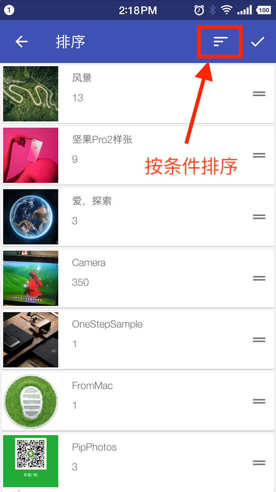

# 本地相册支持拖拽调整相册顺序

这是果仁相册v0.10.0的优化功能。排序功能是从0.4.0开始支持的，本地相册只支持按名称、路径、大小的升降序排列。0.10.0版本优化了本地相册的排序功能，是酷安的某位酷友反馈的需求，做好之后发现确实很实用。我自己写文章需要贴截图的时候用的比较多。

## 使用方法

第一步，选择相册页面

第二步，点击排序

第三步，进入排序界面

在这个界面有两种排序方式：按条件排序和长按手动排序

方式一，按条件排序：

方式二，长按手动排序：

Gif 图片较大，如果想查看请点击这里：[Gif](../imgs/Gif_20190507_144132.gif)

最后调整好顺序之后，请点击右上角的**完成按钮**

