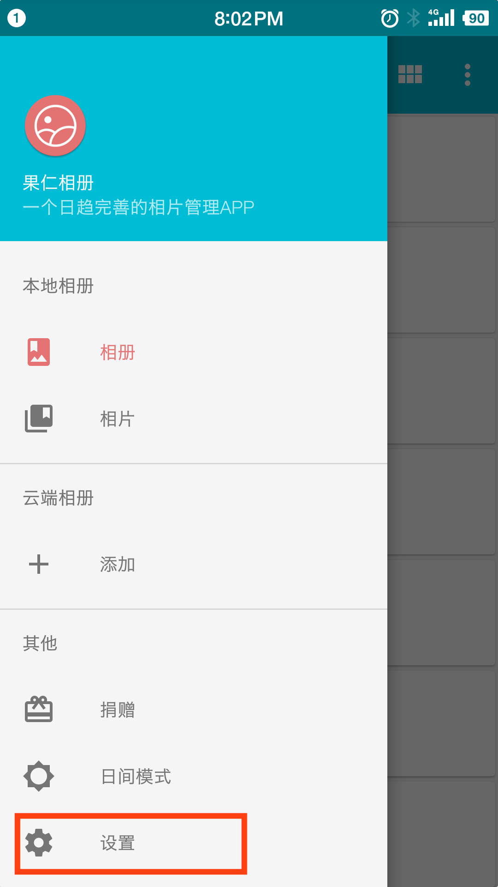

# 排除文件夹

果仁相册v0.13.0中新增了排除文件夹功能，此功能可以隐藏相册及其内部的相片或视频。目前实现的功能比较简单，被排除的相册仅仅是在果仁相册内不可见。

# 使用方法

使用方法包括：排除文件夹和重新显示文件夹

## 排除文件夹

第一步，在主页选择相册

第二步，长按相册进入选择模式

第三步，点击排除文件夹

第四步，点击确认

## 重新显示文件夹

第一步，在主页选择设置

第二步，点击排除文件夹

第三步，点击右边的关闭按钮

第四步，回到主页即可重新显示被排除的文件夹

