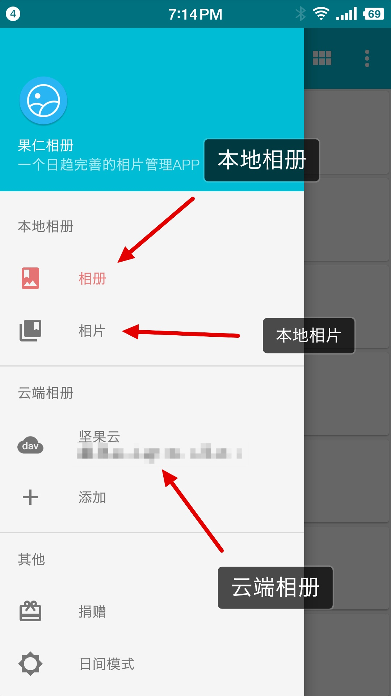

# 本地、云端相片详情页支持设为壁纸

这是0.14.0新增的功能。参考了酷安的酷图模块，对酷安的设为壁纸进行了反推，找到了设置壁纸的方法，感谢酷安。本地和云端的相片详情页都已支持设置壁纸，并且操作方式一致，下面以本地相片详情页为例。

## 使用方法

第一步，从本地相册、本地相片、云端相册进入相片详情页

第二步，进入相册详情页，点击右下角的三个点

第三步，点击设为壁纸按钮

第四步，点击右上角的设置壁纸

