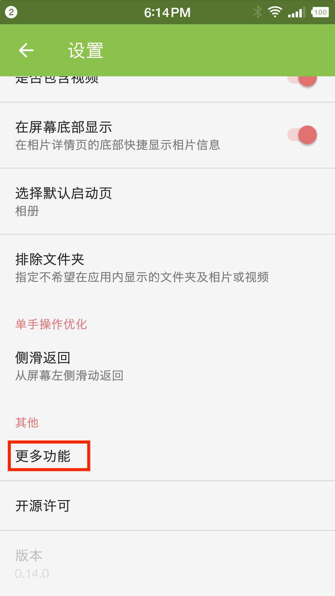
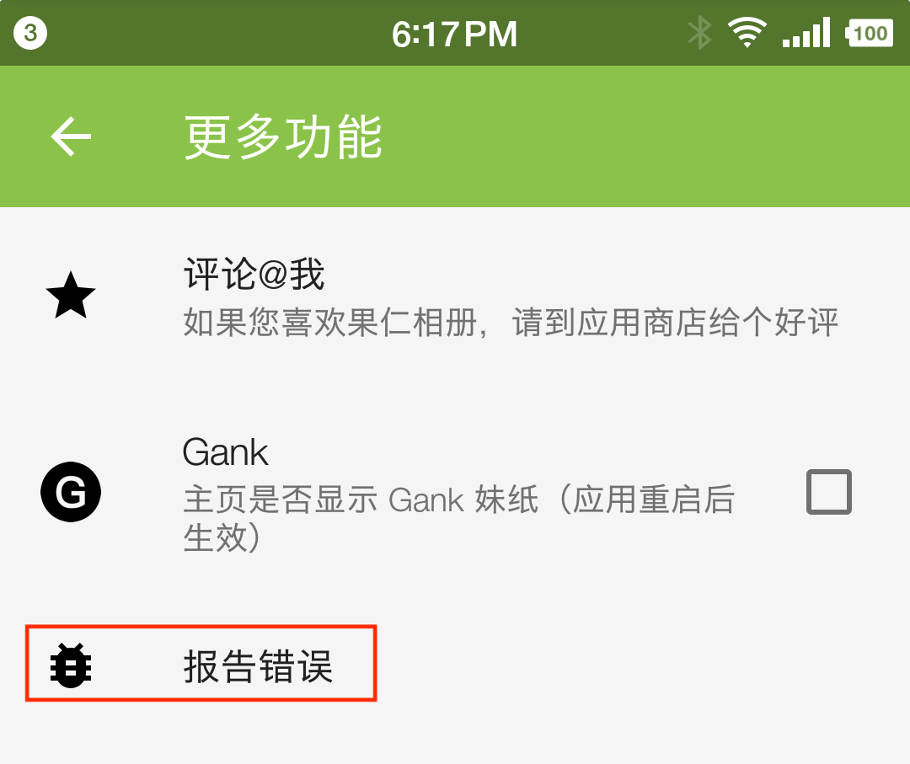
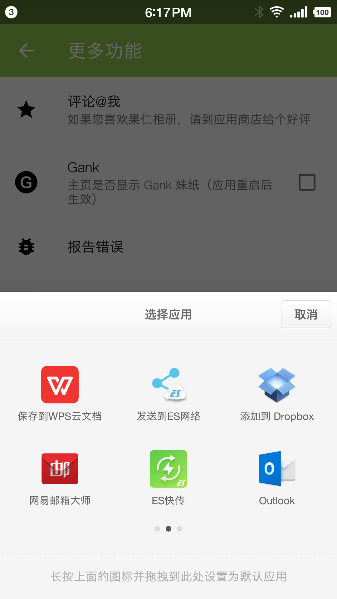

# 如何报告错误

这是0.7.0新增的特性。当您在使用果仁相册时崩溃或者出现其他错误时，果仁相册会把崩溃信息或者其他错误信息保存到日志文件中。这个日志文件的路径为：`/sdcard/Android/data/io.zhuliang.pipphotos.debug/files/log4j`。错误日志对于开发者来说可以更方便的找到错误的原因，当然您并不需要记住这个路径。按照下面的使用，您就可以通过发送邮件，将日志文件发送到我的邮箱。

## 使用说明

1. 启动果仁相册，点击设置选项

   

2. 在设置页面找到"更多功能”选项，点击"更多功能"

   

3. 点击"报告错误"

   

4. 选择邮箱并发送邮件即可

   如果您有什么想跟我说的，也可以写下来😅

   

