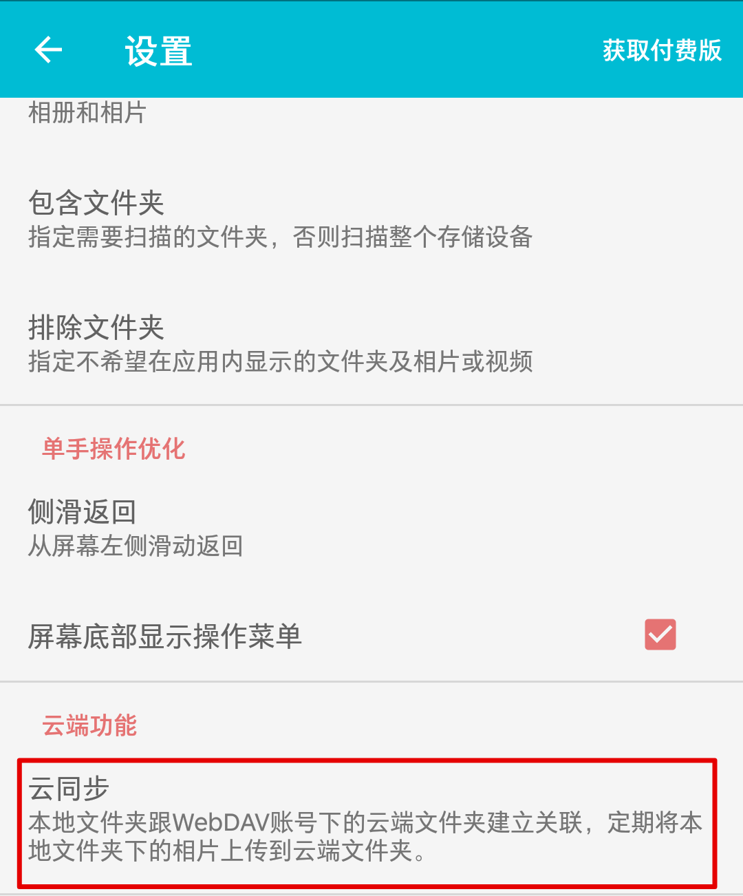
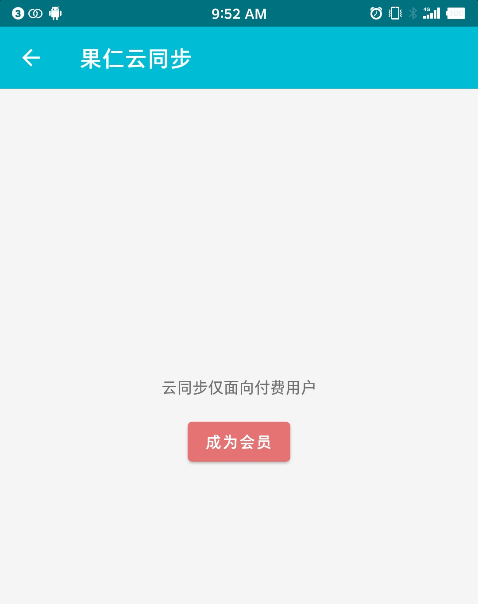
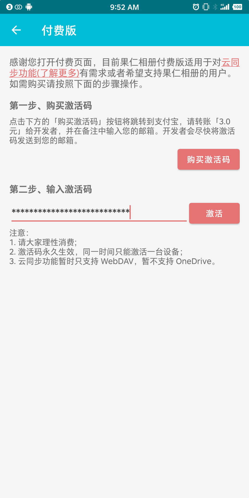
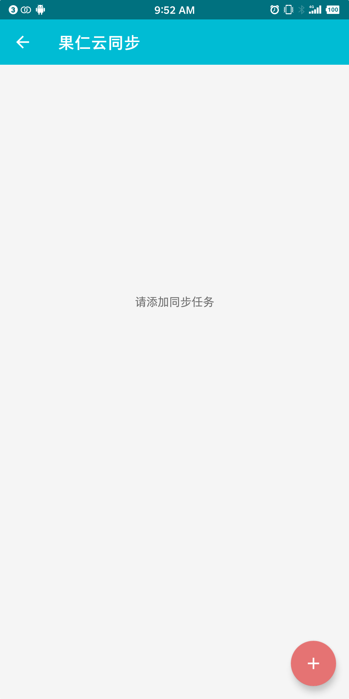
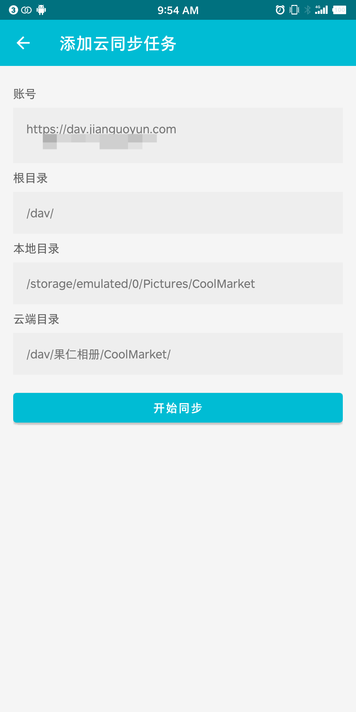
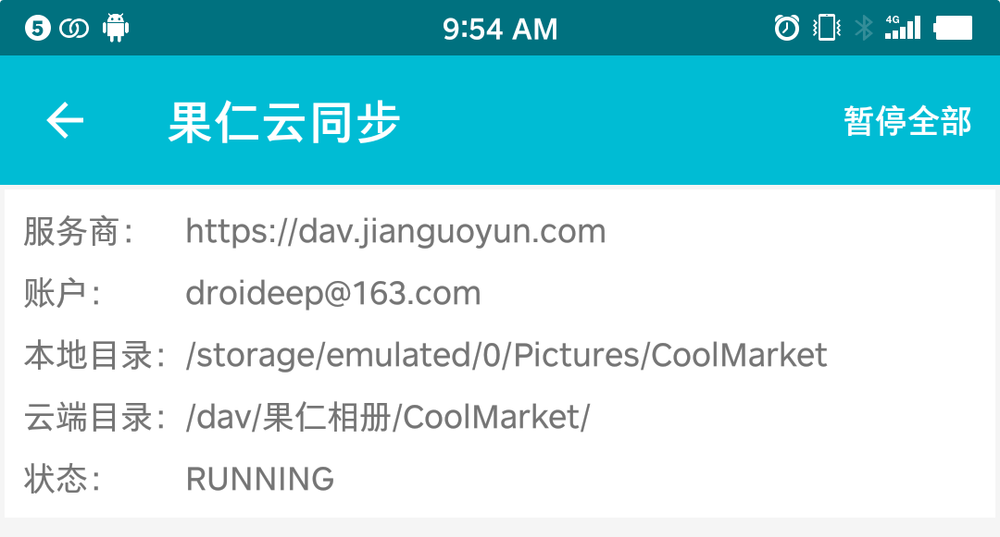

# 如何使用果仁相册的云同步功能

云同步目前实现的功能：
1. 前提：果仁会员、登录 WebDAV 账号
2. 选择本地目录
2. 选择云端目录
4. 比较本地目录和云端目录，找出云端目录不包含的本地相片
4. 上传本地相片
5. 周期性执行 1~5 步骤

## 在果仁相册中的操作步骤

第一步、打开设置页面，点击“云同步”选项

第二步、点击“成为会员”按钮

- 如果还没有激活码请点击“成为会员”，请按照页面的提示进行操作
- 如果有激活码请输入激活码后点击“激活”

第三步、激活后回到“果仁云同步”页面，点击右下角的添加按钮添加同步任务

第四步、按照“添加云同步任务”页面的提示填写相应的信息

注意：添加完第一个同步任务后，再次添加同步任务时，账号栏则不能再修改，也就是说云同步功能只能同步到一个账号上。如果需要同步到其他账号，需要登出当前账号。

第五步、点击“开始同步”后返回“果仁云同步”页面

第六步、同步任务执行时会在通知中心显示

